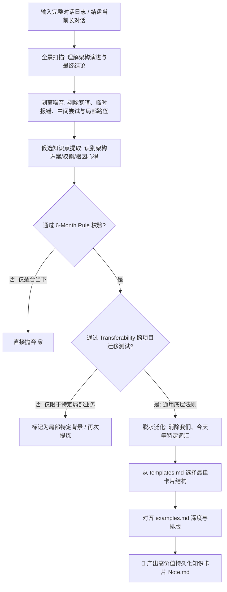

# 🧠 conversation-to-knowledge - 沉浸式对话知识提炼与长效沉淀 Skill

[]()
[]()
[]()
[]()

> 让 AI Agent 化身严格的**高级知识编辑（Knowledge Editor）**，从冗长、繁杂的日常研发对话日志中，精简并提炼出**跨越时光、高可复用的工程知识卡片**，彻底告别"聊完即忘"与信息熵增！

---

## 🤔 解决什么痛点？

在日常与 AI（或团队成员）结对编程、结对架构与排查 Bug 时，我们会产生大量极具价值的思考弧线和对话，但传统处理方式往往存在巨大缺陷：
- ❌ **直接把聊天日志存下来** -> 太过冗长，充斥着"你好"、报错堆栈和临时代码，几个月后根本不想再打开看；
- ❌ **直接让 AI 做常规总结 (Summary)** -> AI 往往只会生成流水账般的记叙文（"我们首先讨论了A，然后尝试了B"），毫无脱水干货；
- ❌ **无法跨项目迁移** -> 具体的代码片段和当下环境深度绑定，难以沉淀为属于开发者个人知识库（Obsidian / Logseq / PKM）的通用法则。

👉 **`conversation-to-knowledge` 的解决方案**：它不是简单的聊天总结器！它严格遵循 **"6 个月生命周期检验"** 与 **"跨项目可迁移性测试"**，剥离临时噪音，精确萃取出真正的**架构模式、权衡决策（Trade-offs）、底层机制心得与反面教材**！

---

## ✨ 核心特性

- 🧹 **降噪滤网 (Noise Filtration)**：自动过滤寒暄、重复解释、临时报错修复、废弃假设与仅适用于当下的局部路径配置；
- ⏳ **两项铁律门槛校验 (Dual Validation Rules)**：
  - **6-Month Rule（半年法则）**：半年后的工程师看到这张卡片，在脱离今天语境的情况下是否依然觉得价值连城？
  - **Transferability Test（可迁移测试）**：不同技术栈、不同项目的工程师读到，能否获得通用的底层原则启发？
- 💎 **高干货粒度 (Atomic Insight Density)**：坚持 **"One insight, one note"（一要点一卡片）**，如果整段长对话没产生真正的通用干货，宁可不出也不产出垃圾信息；
- 📐 **模板与双链驱动**：内置高水准结构化模板（`references/templates.md`）与样例标杆（`assets/examples.md`），并自动支持 Obsidian 风格的 `[[Related Notes]]` 双向关联！

---

## 📂 目录结构

```text
conversation-to-knowledge/
├── README.md                    # 👥 本橱窗说明文档（给人类开发者与知识管理者看）
├── SKILL.md                     # 🤖 AI Agent 专用脑机接口（严格的过滤法则与流程说明）
├── assets/
│   └── examples.md              # 📚 黄金标准样例库（让 AI 自动对齐语气、密度与排版）
└── references/
    └── templates.md             # 📐 知识卡片模板库（包含权衡决策、Bug 根因、架构设计等模板）
```

---

## 🚀 快速开始与调教提示词

### 适用环境
✅ **通用大语言模型 / Agent 环境**。不需要写任何代码或执行外部脚本，纯靠大模型极其严密的元认知（Meta-Cognitive）提示词推理工作。

### 调用方式与典型 Prompt示例

你只需把本技能放入你的 Agent 技能目录，随后在结盘一段技术对话或上传一份历史聊天记录时，直接对 AI 这样说：

```text
请调用 `conversation-to-knowledge` 技能，严格按照作为知识编辑（Knowledge Editor）的法则，对自己/这段聊天日志进行深度提炼，帮我把里面的核心权衡决策和底层踩坑经验沉淀成标准的 Markdown 知识卡片。
```

---

## 🏗️ 知识编辑与提炼决策工作流



---

## 📄 License
MIT
