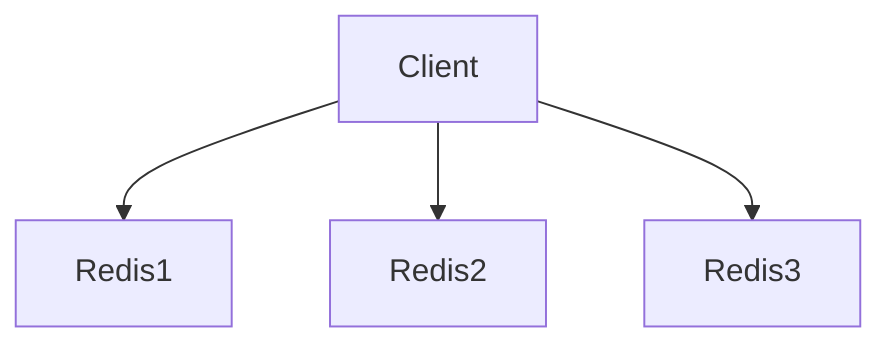

# 🌟 Deep Explainer 黄金范例与对比标杆

本文档用于校准 AI Agent 在技术讲解时的输出深度、节奏与语调。

---

## ❌ BAD Example（糟糕的教科书式回答）

```markdown
# 什么是 Redlock？

Redlock 是 Redis 作者 Salvatore Sanfilippo 提出的一种在分布式环境下使用 Redis 实现分布式锁的算法。它使用 N 个完全独立的 Redis 节点来保证锁的可用性。



以下是加锁代码：
```python
# 贴了 150 行生产级 Redisson / Redis-py 复杂胶水代码，充斥各种异常捕获与重试机制...
```
Redlock 具有高可用性、容错性好的特点，被广泛应用于各类分布式高并发场景。
```

### 为什么这个回答很糟糕？
- **通篇黑话**：直接念名词，没有任何生活化类比，初学者无法建立感性直觉；
- **渲染翻车**：使用了 Mermaid 代码块，在没有渲染引擎的 IDE/终端里只能看到一堆杂乱的代码字符串；
- **代码过载**：贴了 100 多行工业级胶水代码，淹没了算法真正的核心本质；
- **缺乏权衡**：把技术吹成万能银弹，对时钟跳跃、GC STW 等致命隐患只字不提。

---

## ✅ GOOD Example（5 层递进、ASCII 框图的高质量讲解）

```markdown
# 💡 Redlock 算法：多节点分布式法定人数互斥锁

## 🌟 第 1 层：生活常识直觉类比 (Feynman Analogy)
> 想象你去健身房储物柜存包：如果只有 1 个管理员，他一旦请假生病，所有柜子就都乱套了；Redlock 相当于在大厅找了 **5 个互不相干的独立前台**，只要有 **3 个人以上（过半数法定人数）** 在各自本子上登记了柜子归你，并且整个登记过程没超时，这把锁才算真正安全生效！

---

## 🚨 第 2 层：历史背景与痛点倒推 (Why It Exists)
- **单机 Redis 锁的痛点**：单点故障，Redis 实例宕机则全站锁失效；
- **传统主从 Redis 锁的痛点**：主从复制是异步的。客户端 A 在主库加了锁，主库还没来得及同步给从库就挂了，从库升为主库后，客户端 B 也能成功加锁，导致锁被并发重复获取（锁安全性破裂）。
- **Redlock 诞生的使命**：在不依赖 Zookeeper 等重量级强一致性组件的前提下，基于普通的独立 Redis 节点实现容忍单点宕机的高可用分布式互斥。

---

## ⚙️ 第 3 层：第一性原理与核心机制 (Under the Hood)

Redlock 在 5 个独立的 Redis Master 上执行两阶段表决：

```text
  ┌──────────────┐          1. 快速并发广播加锁
  │    客户端     │ ─────────────────────────────────┐
  └──────┬───────┘                                  │
         │                                          ▼
         │ 2. 统计响应结果               ┌─────────────────────┐
         ├─────────────────────────────► │   5 个独立的 Redis   │
         │ (成功数 >= 3 且 耗时 < TTL)    │  [R1] [R2] [R3] ... │
         ▼                              └─────────────────────┘
  ┌──────────────┐
  │ ✅ 加锁成功!  │ ──> 3. 锁的有效时长 = 总TTL - 广播加锁耗时
  └──────────────┘
```

- **核心步骤拆解**：
  1. **记录起始时间**：获取当前毫秒级时间戳；
  2. **向 N 个节点轮流/并发加锁**：设置极短的网络超时（如 5~50ms），防止单个节点卡死阻塞全局；
  3. **计算总耗时与成功数**：当且仅当满足 `成功节点数 >= N/2 + 1` 且 `总耗时 < 锁 TTL` 时，加锁成功；
  4. **失败全量回滚**：如果没达到法定人数，必须立即向所有 N 个节点发送释放锁命令。

---

## 💻 第 4 层：最小可运行极简代码 (Minimal Code Example)

```python
import time

def acquire_redlock(nodes, lock_key, token, ttl_ms=5000):
    start_time = time.time() * 1000
    success_count = 0
    
    for node in nodes:
        # 单节点快速加锁，超时快速放弃
        if node.set(lock_key, token, nx=True, px=ttl_ms, timeout=0.05):
            success_count += 1
            
    elapsed_time = (time.time() * 1000) - start_time
    validity_time = ttl_ms - elapsed_time  # 真正安全可用的业务执行时间
    
    # 核心裁决：过半数成功 且 剩余有效时间 > 0
    if success_count >= (len(nodes) // 2 + 1) and validity_time > 0:
        return True, validity_time
    else:
        # 失败立即回滚
        for node in nodes:
            node.delete(lock_key, token)
        return False, 0
```

---

## ⚖️ 第 5 层：工程权衡与大厂避坑 (Trade-offs & Pitfalls)

| 方案优势 (Pros) | 局限与成本 (Cons / Costs) | 绝对不要用的翻车场景 |
| :--- | :--- | :--- |
| ✅ 不依赖重量级 Paxos/Raft 集群<br>✅ 性能极高，容忍 N/2 个节点宕机 | ⚠️ 依赖系统时钟单调性<br>⚠️ 网络分区与长 GC STW 下可能破裂 | ❌ 银行账务、金融扣款等要求 100% 强一致性的交易场景 |

- 🔥 **生产翻车点（GC STW）**：如果应用发生长达几秒的 Full GC 停顿，进程恢复时锁在 Redis 端其实早已过期，导致两个线程同时进入临界区。
- 🎯 **选型建议**：金融/严苛强一致性优先用 **Zookeeper / Raft 锁**；高并发互联网业务追求性能优先且有兜底机制时选用 **Redlock**。

---

## 🤔 思考小测验 (Socratic Checkpoint)
> **思考题**：如果一个 Redis 节点加锁成功后立即宕机，并且该节点**没有开启 AOF 实时持久化**，它秒级重启后会引发什么并发灾难？在架构上应如何防御？
```
