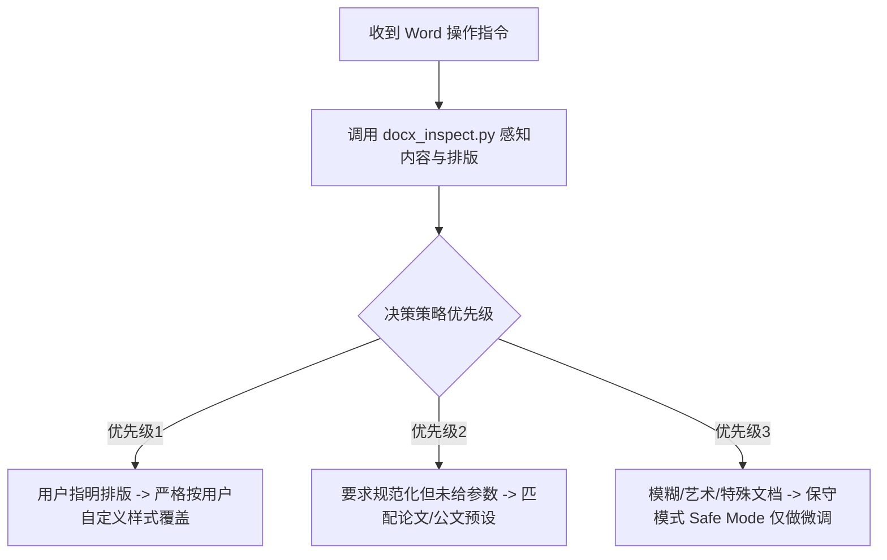

# 📄 docx_editor - 智能 Microsoft Word 文档原子化修改与排版 Skill

[]()
[]()
[]()
[]()

> 让大语言模型（LLM Agent）具备像高级文秘一样的 Word (`.docx`) 文档理解、局部微创替换、规范化排版与模板渲染能力，彻底告别二进制损坏和排版错乱！

---

## 🤔 解决什么痛点？

大模型天然擅长处理纯文本（Markdown/Code），但面对 `.docx` 这种 XML 压缩包时通常束手无策：
- ❌ **直接改底层 XML** -> 极易造成标签错乱，导致 Word 提示文件损坏；
- ❌ **直接使用常规第三方库导出文本** -> 原本精心调整的字号、首行缩进、页眉页脚与表格排版全都被洗掉了；
- ❌ **排版策略一刀切** -> 把用户的艺术简历或特殊合同排乱。

👉 **`docx_editor` 的解决方案**：解耦内容与样式！通过 `inspect` 将排版元数据提炼给 AI，再通过一组精准的“微创手术脚本”由 AI 发起原子操作，做到**“明确排版精准执行，不明确不盲目硬排版”**！

---

## ✨ 核心特性矩阵

- 🕵️ **感知层 (`docx_inspect.py`)**：一秒提取段落/表格结构、主导字体与字号，生成 Markdown 内容简报供 AI 分析；
- 🎨 **排版层 (`docx_format.py`)**：内置 `thesis`（学术论文）、`official_doc`（机关公文）与 `tech_report`（技术报告/设计文档）三大标准预设，支持 CLI / JSON 灵活传入几十项精细样式参数与 `--dry-run` 预览；
- 🎯 **替换层 (`docx_replace.py`)**：跨 Run / 跨表格无损定位查找替换，100% 保持首字符原有的加粗、颜色与字体样式，支持 `--dry-run`；
- 🧩 **填空层 (`docx_template.py`)**：基于 Jinja2 与 `docxtpl` 的专业模版填充引擎，支持 `--json-file` 防止终端转义报错；
- ✍️ **追加层 (`docx_insert.py`)**：指哪插哪，按关键词或序号在指定位置无缝插入新段落并继承上下文排版；
- 🛡️ **工业防呆防线**：全套脚本自动支持前置 `uv --system` 极速依赖自检，并在覆盖保存前**自动生成 `*.bak.docx` 副本备份**！

---

## 📂 目录与文件结构

```text
docx_editor/
├── README.md                 # 👥 本说明文档（给人类开发者和社区用户看）
├── SKILL.md                  # 🤖 AI Agent 专用脑机接口文档（SOP、触发时机与逻辑决策说明）
└── scripts/                  # 🛠️ 底层 Python 原子操作脚本库
    ├── docx_inspect.py       # 内容与排版侦查工具
    ├── docx_format.py        # 智能排版与预设处理工具（支持 thesis/official_doc/tech_report）
    ├── docx_replace.py       # 无损文本及表格精准替换工具
    ├── docx_template.py      # Jinja2 模板变量渲染填空工具
    └── docx_insert.py        # 指定位置段落/文本追加工具
```

---

## 🚀 快速开始与安装

### 1. 依赖准备
我们强烈推荐使用极速包管理器 [uv](https://github.com/astral-sh/uv) 将依赖直接装入全局或系统 Python 环境中（速度比普通 pip 快几十倍）：
```bash
uv pip install --system python-docx docxtpl lxml
```
> 如果未安装 `uv`，也支持常规 pip 安装：`pip install python-docx docxtpl lxml`

### 2. 在 Agent/项目中使用
直接将整个 `docx_editor` 目录拷贝至你的 Agent 技能中心（如 `.agents/skills/docx_editor/`）。你的 AI Agent 启动时会自动挂载并阅读 `SKILL.md`，遇到需要处理 Word 的场景时便会自主调用这里的 Python 脚本。

---

## 💻 典型脚本调用示例 (CLI API)

你也可以随时在命令行终端直接调用这些工具，独立完成 Word 文档处理：

```bash
# 1. 侦查文档概况与排版信息
python scripts/docx_inspect.py input.docx --preview-lines 50

# 2. 将文档一键排版为技术报告格式（11pt 微软雅黑 + 1.35倍行距 + 顶格排版）
python scripts/docx_format.py input.docx --preset tech_report --output tech_report_out.docx

# 3. 演练模式：先预览检测而不实际修改文件
python scripts/docx_format.py input.docx --preset thesis --dry-run

# 4. 在文末追加一段致谢，自动沿用原文档正文样式
python scripts/docx_insert.py input.docx --at-end --content "致谢：感谢各位老师与同学的悉心指导..." -o out.docx

# 5. 模板变量填充（配合 JSON 数据文件）
python scripts/docx_template.py 实习证明模板.docx --json-file data.json --output 张三_实习证明.docx
```

---

## 🏗️ 架构与排版决策流程



---

## 📄 License
本 Skill 基于 MIT 协议开源，欢迎提交 PR 贡献更多行业标准的 Word 排版预设与脚本工具！
