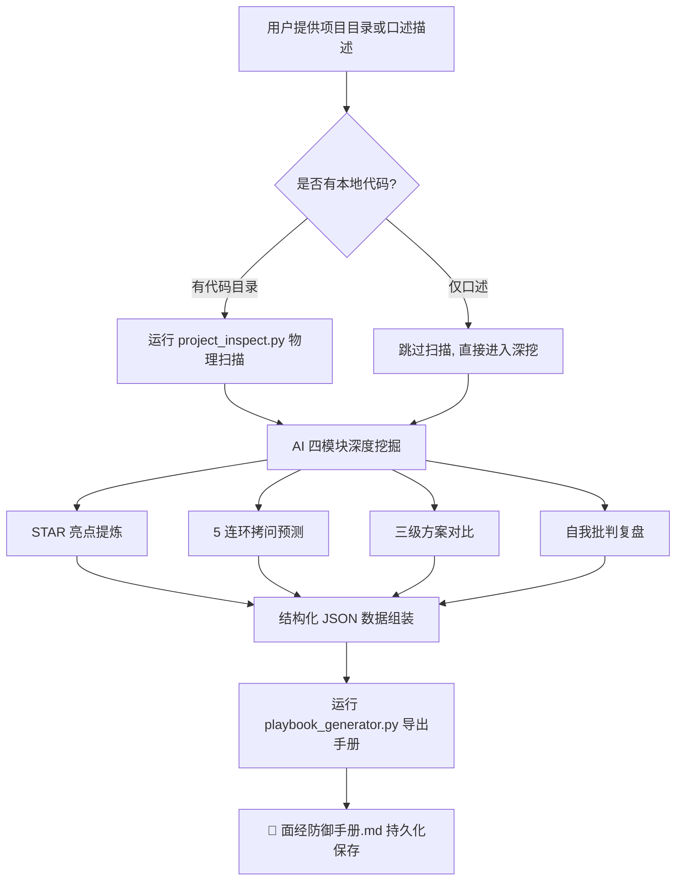

# 🎯 project_deep_diver - 秋招/社招项目深挖面经利器

[]()
[]()
[]()
[]()

> 让 AI Agent 化身大厂资深面试官，**自动扫描你的真实项目代码**，提炼 STAR 法则高光亮点，预测 5 层连环深挖拷问，并一键导出可打印的面经防御手册！

---

## 🤔 解决什么痛点？

秋招/社招面试的"项目深挖"环节是大多数候选人最头疼的关卡：
- ❌ **说不出亮点**：明明做了很多功能，但一到面试就只会说"增删改查"；
- ❌ **怕被追问穿**：面试官一追问架构选型、极端场景、性能瓶颈就哑口无言；
- ❌ **复盘没有沉淀**：和 AI 聊完就忘了，面试前临时翻聊天记录，找不到要点。

👉 **`project_deep_diver` 的解决方案**：自动扫描你的项目代码仓库获取真实技术栈，用 AI 深度挖掘提炼出工业级包装话术，最终**导出为一份标准化、可打印的 Markdown 面经防御手册**，面试前 15 分钟快速过一遍就能信心倍增！

---

## ✨ 核心特性

- 🔬 **项目物理扫描 (`project_inspect.py`)**：零依赖秒级遍历项目目录，自动统计代码行数、识别技术栈指纹（Vue/React/Spring Boot/Redis/Docker 等）、解析 `package.json` / `requirements.txt` 等核心依赖清单；
- 🧠 **AI 四模块深度挖掘**：STAR 法则亮点包装 → 5 连环面试官压力拷问预测 → 初级/当前/终极方案三级对比 → 自我批判成长复盘；
- 📄 **面经手册一键导出 (`playbook_generator.py`)**：将深挖成果自动格式化为精美的 Markdown 文档，带封面、表格、分类图标，随时打印或发送到手机复习；
- 🎯 **真实技术栈驱动**：不是空中楼阁式的通用模板，而是基于你**真实项目代码**的精准深挖！

---

## 📂 目录结构

```text
project_deep_diver/
├── README.md                        # 👥 本说明文档（给人类开发者看）
├── SKILL.md                         # 🤖 AI Agent 专用 SOP 脑机接口
└── scripts/                         # 🛠️ 底层原子工具
    ├── project_inspect.py           # 项目技术栈与架构指纹扫描仪
    └── playbook_generator.py        # 面经防御手册 Markdown 生成器
```

---

## 🚀 快速开始

### 环境要求
✅ **零外部依赖**！只需要 Python 3.9+（使用标准库 `os`, `json`, `pathlib`, `collections`）。

### 使用方式

#### 1. 扫描你的项目目录
```bash
# 输出 JSON 格式的技术侦查报告
python scripts/project_inspect.py /path/to/your/project

# 输出 Markdown 可读简报
python scripts/project_inspect.py /path/to/your/project --markdown

# 导出 JSON 报告到文件
python scripts/project_inspect.py /path/to/your/project --output report.json
```

#### 2. 生成面经防御手册
```bash
# 将 AI 深挖的结构化数据导出为精美 Markdown 手册
python scripts/playbook_generator.py \
    --project-name "万方数据平台" \
    --json-file deep_dive_data.json \
    --output "面经防御手册_万方数据平台.md"
```

---

## 🏗️ 工作流程



---

## 📄 License
MIT
