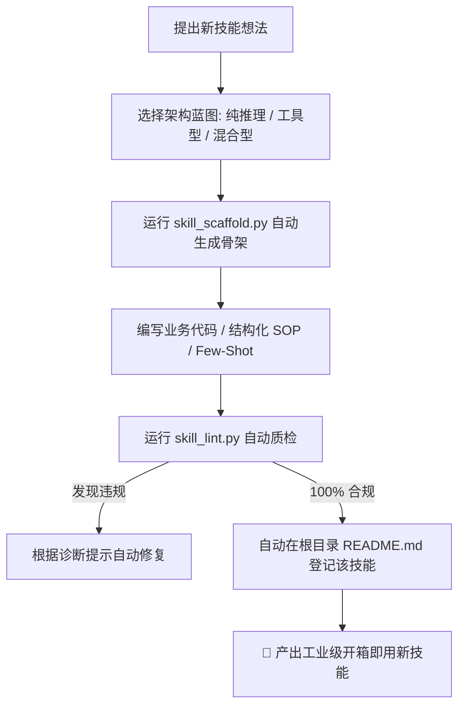

# 🛠️ skill_creator - AI Agent 技能架构师与脚手架工具

[]()
[]()
[]()
[]()

> 让 AI Agent 具备**“自我繁殖、架构设计与工业级质量审计”**的能力。一键创建 100% 符合双轨协议、预置安全底线与全平台防错的开箱即用 Agent 技能！

---

## 🤔 解决什么痛点？

在给 AI 开发自定义 Agent Skills 时，开发者和 AI 助手往往会犯以下常见错误：
- ❌ **人机文档不分**：把给人类看的背景废话写进 `SKILL.md`，严重浪费大模型上下文窗口和 Token；
- ❌ **触发语义缺失**：Frontmatter 中的 `description` 描述过于模糊，导致 AI 在该用的时候根本想不到调用；
- ❌ **忽视运行环境**：忘记写前置依赖自检，Agent 运行中途报 `ModuleNotFoundError` 崩溃；
- ❌ **破坏用户数据**：脚本直接覆盖写文件，没有保留备份，误操作无法回滚；
- ❌ **跨平台乱码**：在 Windows PowerShell/CMD 下打印中文或 Emoji 发生 `UnicodeEncodeError` 报错。

👉 **`skill_creator` 的解决方案**：提供一套经过实战打磨的脚手架引擎与规范扫描仪，从目录生成、代码骨架、安全防护到最终合规质检，全部自动化流水线搞定！

---

## ✨ 核心特性

- ⚡ **秒级脚手架生成 (`skill_scaffold.py`)**：支持纯推理型（Prompt-only）、工具驱动型（Tool-assisted）与混合推理型（Hybrid）三大标准蓝图，一键生成完整目录；
- 🛡️ **预置工业级安全底线**：自动在生成的 Python 脚本中注入 **Windows UTF-8 终端重配置**、**`*.bak` 目标文件覆盖自动备份** 与 **`pathlib.Path` 安全路径**；
- 🔍 **合规与规范质检仪 (`skill_lint.py`)**：一键对任意技能进行静态扫描，依据 [AGENTS.md](../../../AGENTS.md) 规则检查 Frontmatter、第 0 步自检、备份机制覆盖率，并输出诊断报告；
- 🌐 **双语与双轨制原生支持**：支持中英文模板生成，严格践行“`SKILL.md` 面向 AI，`README.md` 面向人类”的双轨分离原则。

---

## 📂 目录结构

```text
skill_creator/
├── README.md                      # 👥 本说明文档（给人类开发者看）
├── SKILL.md                       # 🤖 AI Agent 专用 SOP 脑机接口
├── references/
│   └── skill_blueprint.md         # 📐 3 种标准模式蓝图与代码规范库
└── scripts/
    ├── skill_scaffold.py          # 🛠️ 自动化脚手架生成器
    └── skill_lint.py              # 🔍 技能合规质检与安全扫描仪
```

---

## 🚀 快速开始 (CLI)

### 环境要求
✅ **零外部依赖**！仅使用 Python 3.9+ 标准库。

### 1. 命令行一键生成新技能骨架

```bash
# 生成一个工具辅助型中文技能
python scripts/skill_scaffold.py csv_analyzer \
    --type tool_assisted \
    --desc "用于海量 CSV 数据快速分析与图表提取的工具集" \
    --lang zh

# 生成一个纯 Prompt 推理型英文技能
python scripts/skill_scaffold.py git_commit_curator \
    --type prompt_only \
    --desc "Curate and format high-standard git commit messages" \
    --lang en
```

### 2. 对技能进行工业级合规质检

```bash
# 扫描单个技能
python scripts/skill_lint.py .agents/skills/docx_editor

# 全量扫描仓库下的所有技能
python scripts/skill_lint.py --all
```

---

## 🏗️ 工作流程



---

## 📄 License
MIT
