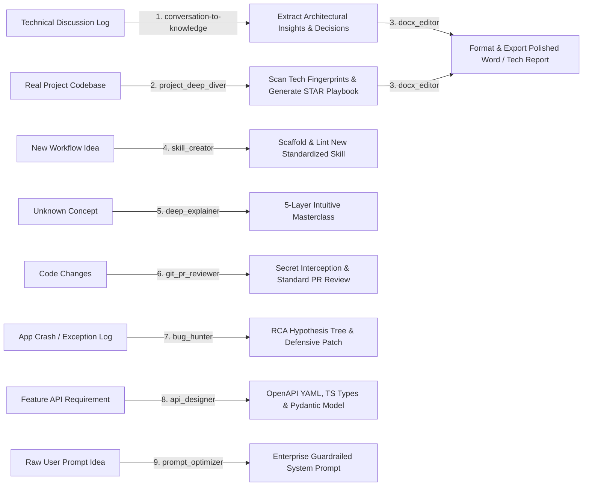
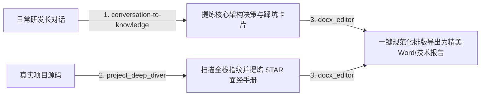

# 🛠️ Awesome-Agent-Skills

[English](#english) | [中文](#中文)

---

<a name="english"></a>
## 🇺🇸 English

### 💡 Background & Purpose

When using AI (LLMs, Cursor, Claude, etc.) in daily engineering workflows, we often repeat complex multi-step tasks. Relying on ad-hoc prompts every time is inefficient and prone to errors.

**Awesome-Agent-Skills** is dedicated to **curating daily AI Standard Operating Procedures (SOPs) into standardized, reusable Agent Skills**. By turning common AI workflows into robust, structured skills, any AI assistant can execute complex tasks reliably with zero setup friction.

---

### 📦 Available Skills Matrix

| Skill | Category | Type | Core Highlights | Dependencies |
| :--- | :--- | :---: | :--- | :--- |
| [**`bug_hunter`**](./.agents/skills/bug_hunter) | Debugging & SRE | 🛠️ Tool-Assisted | Stack trace log inspector, automated sensitive data masking, ASCII root cause hypothesis trees, 10-line MRE, and defensive patches. | None (Standard Library) |
| [**`api_designer`**](./.agents/skills/api_designer) | API Engineering | 🛠️ Tool-Assisted | RESTful resource modeling, OpenAPI 3.0 YAML, TypeScript interfaces, Pydantic schemas, Mock data generator, and Idempotency design. | None (Standard Library) |
| [**`prompt_optimizer`**](./.agents/skills/prompt_optimizer) | Prompt Engineering | 🧠 Pure Reasoning | RCCIO framework, security guardrails against jailbreaks/injections, strict JSON Schema enforcing, and 3-group adversarial test suite. | None (Meta-Cognitive) |
| [**`git_pr_reviewer`**](./.agents/skills/git_pr_reviewer) | Code Review & Git | 🛠️ Tool-Assisted | Git diff extraction, static Secret & API Key leakage interceptor, Conventional Commits generator, and tech-lead level PR review. | None (Standard Library) |
| [**`deep_explainer`**](./.agents/skills/deep_explainer) | Learning & Mentoring | 🧠 Pure Reasoning | Feynman analogy, historical pain-point framing, clean ASCII text dataflows (No Mermaid), 20-line minimal code, and trade-off matrix. | None (Meta-Cognitive) |
| [**`skill_creator`**](./.agents/skills/skill_creator) | Meta-Engineering | 🛠️ Scaffold + Linter | Interactive skill architect, one-click scaffold generation (`skill_scaffold.py`), and industrial-grade safety linter (`skill_lint.py`). | None (Standard Library) |
| [**`docx_editor`**](./.agents/skills/docx_editor) | Document Engineering | 🛠️ Tool-Assisted | Academic (`thesis`), official (`official_doc`), and tech report (`tech_report`) presets, lossless text replacement, Jinja2 templating, and `--dry-run` inspection. | `python-docx`, `docxtpl` |
| [**`project_deep_diver`**](./.agents/skills/project_deep_diver) | Career & Interview | 🧠 Tool + Reasoning | Full-stack & AI/LLM fingerprint scanning, STAR highlight extraction, 5-level grilling QA prediction, and live Mock Interview mode. | None (Standard Library) |
| [**`conversation-to-knowledge`**](./.agents/skills/conversation-to-knowledge) | Knowledge Management | 🧠 Pure Reasoning | 6-Month Rule & Transferability Test, Obsidian/Logseq YAML Frontmatter extraction, and incremental vault merging. | None (Meta-Cognitive) |

---

### ⛓️ Skill Chaining & Workflow

Skills in this repository are designed to be composable into end-to-end autonomous workflows:



---

### 📐 Skill Structure & Conventions

Every skill lives under `.agents/skills/<skill_name>/` and follows our **Dual-Track Protocol**:

```text
.agents/skills/<skill_name>/
├── README.md       # 👥 For Humans: Documentation, use cases, and CLI examples
├── SKILL.md        # 🤖 For AI Agents: Concise brain-computer interface (SOP & rules)
└── scripts/        # 🛠️ For Execution: Atomic Python/Shell utility scripts
```

**Key Guardrails:**
- **Environment Dependency Check**: Every `SKILL.md` verifies required packages first (recommends `uv pip install --system`).
- **Automatic Backups**: Scripts modifying local files must automatically create `*.bak` backups before writing.
- **Conventional Commits**: All contributions follow exact rules defined in [AGENTS.md](./AGENTS.md).

---

### 🚀 Quick Start

#### 1. Mount to AI Workspace (Recommended)
Copy or symlink any skill directory directly into your AI agent or IDE rules folder (e.g., `.agents/skills/` or `.cursor/rules/`):
```bash
git clone https://github.com/jinjie0703/Awesome-Agent-Skills.git
```

#### 2. Run CLI Scripts Directly
You can also run the atomic scripts independently via terminal:
```bash
cd .agents/skills/docx_editor
uv pip install --system python-docx docxtpl lxml
python scripts/docx_inspect.py /path/to/document.docx
```

---

<a name="中文"></a>
## 🇨🇳 中文

### 💡 背景与初衷

在日常使用 AI（如 LLM、Cursor、Claude 等）结对编程或处理复杂任务时，我们往往需要反复重复多步骤的作业流程（SOP）。每次都从零编写提示词不仅效率低下，且容易出错和产生幻觉。

**Awesome-Agent-Skills** 的核心目的就是：**沉淀日常使用 AI 的 SOP，将其封装为标准化、可复用的 Agent 技能库**。把日常好用的 AI 工作流沉淀成清晰的“流程规范 + 底层脚本”，让任何 AI 助手都能开箱即用、高效准确地完成复杂作业。

---

### 📦 技能全景矩阵 (Skills Matrix)

| 技能名称 | 应用领域 | 类型 | 核心特性与亮点 | 环境依赖 |
| :--- | :--- | :---: | :--- | :--- |
| [**`bug_hunter`**](./.agents/skills/bug_hunter) | 故障排障与根因分析 | 🛠️ 工具型 | 跨语言异常堆栈提取，日志敏感信息自动脱敏，ASCII 根因假设树，10 行极简复现 (MRE) 与防御性修复补丁 | 零依赖（Python 标准库） |
| [**`api_designer`**](./.agents/skills/api_designer) | 接口工程与数据契约 | 🛠️ 工具型 | RESTful 资源建模，OpenAPI 3.0 YAML、TypeScript 接口契约、Pydantic 校验模型与 Mock 数据一键多端生成，内置幂等性令牌设计 | 零依赖（Python 标准库） |
| [**`prompt_optimizer`**](./.agents/skills/prompt_optimizer) | 提示词工程与评测 | 🧠 纯推理 | RCCIO 工业框架，注入防御与越狱护栏 (Guardrails)，严格 JSON Schema 锁定，自带 3 组对抗压力测试套件 | 零依赖（元认知 Prompt） |
| [**`git_pr_reviewer`**](./.agents/skills/git_pr_reviewer) | 代码评审与 Git 门禁 | 🛠️ 工具型 | Git Diff 提取，静态高危 Secret/API Key 泄露拦截，代码异味捕获，自动生成 Conventional Commits 提交与大厂级 PR 审查报告 | 零依赖（Python 标准库 + Git） |
| [**`deep_explainer`**](./.agents/skills/deep_explainer) | 技术学习与导师 | 🧠 纯推理 | 费曼生活化类比，历史痛点倒推，全平台兼容的纯文本 ASCII 框图（拒绝 Mermaid 翻车），20 行极简脱水代码与权衡避坑矩阵 | 零依赖（元认知 Prompt） |
| [**`skill_creator`**](./.agents/skills/skill_creator) | 元工程与脚手架 | 🛠️ 脚手架+质检 | 交互式技能架构设计，一键秒级生成标准化骨架（`skill_scaffold.py`），全流程工业级规范合规质检（`skill_lint.py`） | 零依赖（Python 标准库） |
| [**`docx_editor`**](./.agents/skills/docx_editor) | 文档工程与排版 | 🛠️ 工具型 | 论文（`thesis`）、公文（`official_doc`）与技术报告（`tech_report`）标准预设，无损跨 Run 替换，Jinja2 模板填空，支持 `--dry-run` 预览与强制备份 | `python-docx`, `docxtpl` |
| [**`project_deep_diver`**](./.agents/skills/project_deep_diver) | 职场求职与面经 | 🧠 工具+推理 | 全栈与 AI/LLM/Monorepo 指纹扫描，STAR 法则亮点包装，5 连环拷问预测，支持模拟面试官即时对线与手册导出 | 零依赖（Python 标准库） |
| [**`conversation-to-knowledge`**](./.agents/skills/conversation-to-knowledge) | 知识管理与沉淀 | 🧠 纯推理 | 半年法则与可迁移测试双重过滤，Obsidian/Logseq PKM 规范双链模板，支持知识增量合并与去重 | 零依赖（元认知 Prompt） |

---

### ⛓️ 技能联动闭环 (Skill Chaining)

仓库中的各项技能支持组合编排，形成端到端的高效工程闭环：



---

### 📐 技能目录规范

所有技能模块统一存放在 `.agents/skills/<skill_name>/` 目录下，严格遵从**双轨制协议 (Dual-Track Protocol)**：

```text
.agents/skills/<skill_name>/
├── README.md       # 👥 人类开发者说明书（解决的痛点、核心特性、命令行用法）
├── SKILL.md        # 🤖 AI 脑机接口文档（简明干练，包含触发条件、环境自检与 SOP 步骤）
└── scripts/        # 🛠️ 底层脚本工具箱（高效可靠的原子化 Python/Shell 脚本）
```

**核心安全防线：**
- **环境检查优先**：每个 `SKILL.md` 的第一步执行依赖自检（强推使用 `uv pip install --system` 极速安装）。
- **强制回滚备份**：任何修改用户本地文件的脚本，在操作前必须自动生成 `*.bak` 备份，确保安全无损。
- **协同提交规范**：所有人与 AI 的贡献均需遵循 [AGENTS.md](./AGENTS.md) 中约定的 Conventional Commits 提交规范。

---

### 🚀 快速使用

#### 1. 挂载至 Agent 工作区 (推荐)
直接将所需技能文件夹复制或软链至你的 AI 助手工作区或 IDE 插件目录（如 `.agents/skills/` 或 `.cursor/rules/`）：
```bash
git clone https://github.com/jinjie0703/Awesome-Agent-Skills.git
```

#### 2. 命令行独立调用
你也可以直接通过命令行调用每个技能下的原子工具脚本：
```bash
cd .agents/skills/docx_editor
uv pip install --system python-docx docxtpl lxml
python scripts/docx_inspect.py /path/to/document.docx
```

---

## 🤝 Contributing / 贡献指南

欢迎将你日常积累的 AI 优秀 SOP 沉淀为 Skill！请务必遵循 **双轨制结构** 与 **[AGENTS.md](./AGENTS.md)** 规范提交 Pull Request，一起共建简洁高效的 AI 技能库！

---

## 📄 License
[MIT License](./LICENSE)
